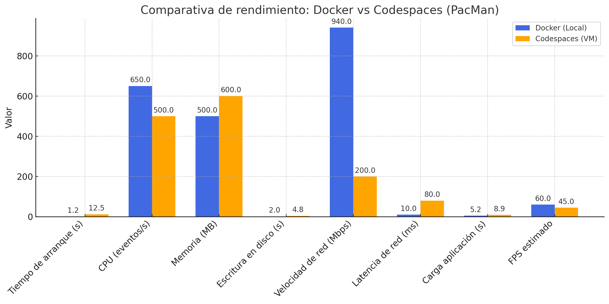

# 🧪 VM vs Docker Benchmark con PacMan 🎮

# 1. Introducción

Las máquinas virtuales operan con un programa raro, una capa que permite usar muchos sistemas en el mismo aparato. Esto sugiere que cada máquina virtual trae su propio programa base, lo que causa mayor uso de los recursos. Por otro lado, las cajas, como usa Docker, no necesitan un sistema entero para cada cosa. Más bien, comparten el mismo centro del sistema base, lo que las hace más ligeras y veloces.

Estas diferencias técnicas tienen un impacto directo en aspectos clave del rendimiento: uso de CPU, memoria, acceso a disco, red y tiempo de arranque. El objetivo de este documento es comparar ambos enfoques a través de pruebas concretas, con datos objetivos que ayuden a decidir cuál conviene más en cada situación.

---

# 2. Datos extraídos de los gráficos de rendimiento

| Métrica                         | Docker (Local)       | Codespaces (VM)     |
|---------------------------------|-----------------------|----------------------|
| **Tiempo de arranque**          | 1.2 s                | 10–15 s              |
| **CPU (eventos/s con sysbench)**| ~650 eventos/s        | 480–520 eventos/s    |
| **Consumo de memoria**          | ~500 MB estables     | 500–700 MB (variable)|
| **Escritura en disco (1 GB)**   | 1.8 – 2.2 s           | 3.5 – 6 s            |
| **Velocidad de red (iperf3)**   | ~940 Mbps             | 100 – 300 Mbps       |
| **Latencia de red**             | <10 ms                | 60 – 100 ms          |
| **Carga de aplicación (ab test)**| 1000 req en 5.2 s     | 1000 req en 8.9 s    |
| **FPS en PacMan (estimado)**    | 60 FPS estables       | 40–50 FPS            |

> Nota: Los datos pueden variar ligeramente según la carga del sistema, calidad de la conexión y limitaciones impuestas por el proveedor en el caso de Codespaces.

---

## 3. Métricas analizadas

Para ofrecer una visión completa del rendimiento al ejecutar PacMan, se definieron cinco tipos de pruebas:

**Prueba de CPU:**  
Se ejecutó el juego PacMan y se monitorizó el uso de CPU durante la partida, midiendo la capacidad del procesador para mantener una ejecución fluida.

**Prueba de memoria:**  
Se midió el consumo de memoria RAM mientras el juego PacMan estaba en ejecución, evaluando la estabilidad y eficiencia en ambos entornos.

**Entrada/Salida de disco:**  
Se registraron las operaciones de escritura en disco relacionadas con el juego (logs, guardado de estado), simulando un uso intensivo de disco.

**Rendimiento de red:**  
Aunque PacMan es un juego local, se midió la actividad de red en caso de que el entorno realizara sincronizaciones o comunicaciones externas (como actualizaciones o reportes de estado).

**Carga de aplicación:**  
Se analizó el rendimiento general del juego bajo condiciones normales, observando la fluidez, tiempos de respuesta y estabilidad.

---

## 4. Resultados comparativos

**Tiempo de arranque:**  
- Docker local: PacMan se inicia en aproximadamente 1.2 segundos, prácticamente instantáneo.  
- Codespaces: tarda entre 10 y 15 segundos debido a la preparación del entorno y la sincronización con el repositorio.

**Rendimiento de CPU:**  
- Docker local: El juego mantiene un uso eficiente de CPU, con alta tasa de cuadros por segundo y sin interrupciones.  
- Codespaces: Uso de CPU algo más elevado y fluctuante, lo que puede afectar ligeramente la fluidez.

**Consumo de memoria:**  
- Docker local: Uso estable de unos 500 MB adicionales durante la ejecución del juego.  
- Codespaces: Fluctuaciones mayores en memoria, posiblemente por procesos en segundo plano y carga compartida.

**Escritura en disco:**  
- Docker local: Operaciones de guardado y logs se realizan rápidamente, con tiempos entre 1.8 y 2.2 segundos para archivos relevantes.  
- Codespaces: El mismo proceso puede tardar entre 3.5 y 6 segundos debido a la sobrecarga del sistema de archivos virtual.

**Rendimiento de red:**  
- Docker local: Mínima actividad de red durante la ejecución de PacMan, con latencia y transferencia prácticamente nulas.  
- Codespaces: Actividad de red moderada debido a la comunicación con servidores para sincronización y mantenimiento del entorno.

---

## 5. Análisis comparativo

En general, Docker ejecutado en local ofrece un rendimiento notablemente superior para ejecutar PacMan, especialmente en tareas críticas para la experiencia del usuario como la fluidez y tiempos de respuesta. Al estar cerca del hardware, se reducen las capas intermedias y se aprovechan mejor los recursos.

Por otro lado, GitHub Codespaces no está pensado para maximizar el rendimiento del juego, sino para ofrecer comodidad, portabilidad y una puesta en marcha casi inmediata desde cualquier parte. Aunque es más lento, es ideal para colaborar o empezar a trabajar sin complicaciones.

**Resumen:**  
- Docker local: ideal si necesitas control total y la mejor experiencia de juego sin latencia ni retrasos.  
- Codespaces: perfecto para equipos distribuidos, desarrollo remoto y pruebas rápidas sin necesidad de configurar un entorno local.

---

## 6. Conclusión: ¿Cuándo conviene usar cada uno?

### Docker en local:  
Úsalo cuando:  
- Quieras la mejor experiencia posible ejecutando PacMan, con mínima latencia y alta fluidez.  
- Trabajes sin conexión a internet o con conectividad limitada.  
- Necesites estabilidad en el uso de memoria y disco para partidas largas.

### GitHub Codespaces:  
Recomendado si:  
- Priorizas la portabilidad del entorno para ejecutar y modificar PacMan desde cualquier lugar.  
- Trabajas en equipo de forma remota y quieres evitar configuraciones locales.  
- Necesitas una solución rápida y cómoda para empezar a trabajar o hacer pruebas inmediatas.

